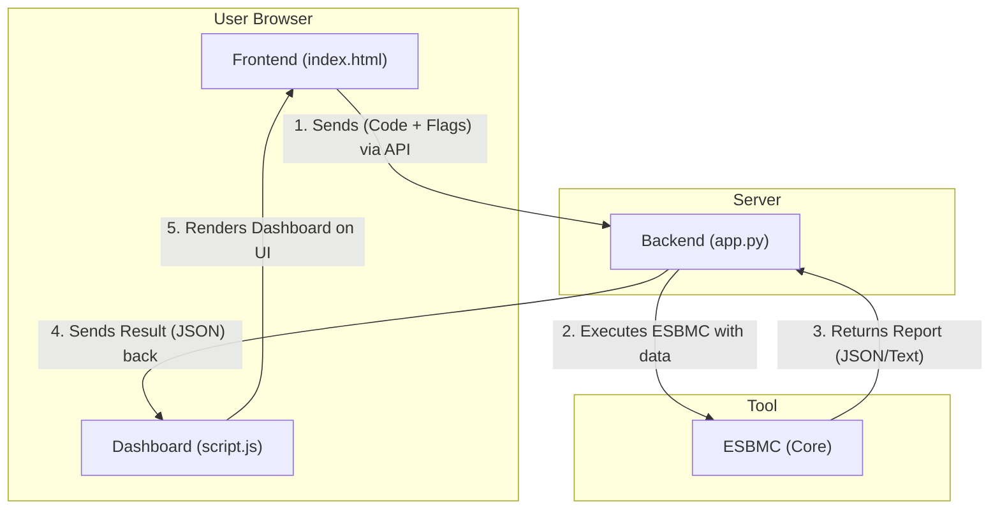
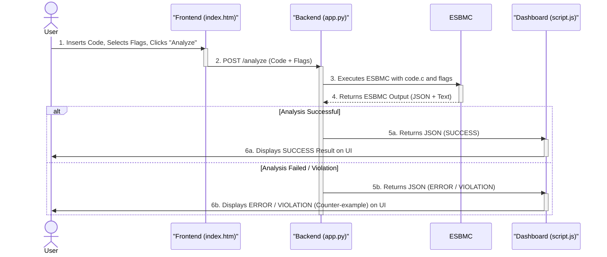

# ESBMC-Web - ESBMC Code Analyzer

Este repositório contém o dashboard web para análise de código com ESBMC.

## Arquitetura (Fluxo de Dados)
The diagram below illustrates the order of interactions:



## Architecture (Sequence of Events)
The diagram below illustrates the order of interactions:




## Arquitetura

O projeto é dividido em duas partes:
* `/backend`: Um servidor Flask (Python) que recebe o código e executa o ESBMC.
* `/frontend`: Uma página HTML/JS estática que serve como interface para o usuário.

## Instalação (Setup)

1.  Clone o repositório:
    ```bash
    git clone [https://github.com/esbmc/esbmc-web.git](https://github.com/esbmc/esbmc-web.git)
    cd esbmc-web
    ```

2.  Crie e ative um ambiente virtual (recomendado):
    ```bash
    python -m venv venv
    source venv/bin/activate  # No Linux/macOS
    # ou
    .\venv\Scripts\activate   # No Windows
    ```

3.  Instale as dependências do backend:
    ```bash
    pip install -r backend/requirements.txt
    ```

## Como Executar (Usage)

1.  Inicie o servidor backend:
    ```bash
    python backend/app.py
    ```

2.  Abra o arquivo `frontend/index.html` diretamente no seu navegador.
