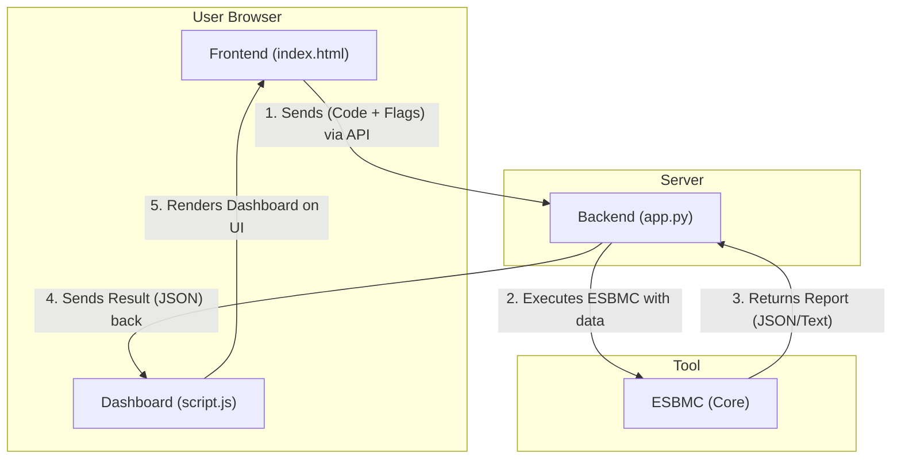
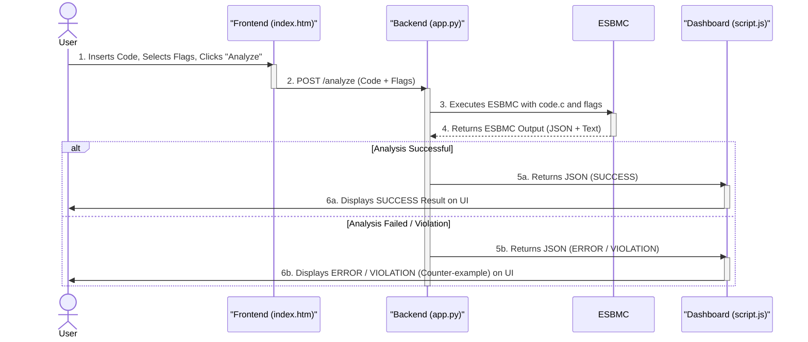

# ESBMC-Web - ESBMC Code Analyzer

ESBMC-Web is a web-based graphical user interface (GUI) for the ESBMC verifier. It allows users to write, upload, and analyze C, C++, or Python code directly in the web browser. The tool provides a user-friendly way to select various ESBMC analysis flags and parameters. Results are presented in two formats:
- **Raw Text Output**: The complete, unfiltered console log from the ESBMC tool.
- **Dashboard View**: A rich, interactive dashboard that visualizes violations, counterexamples, and execution traces, making it easier to debug failed verifications.

## Features:

- **In-Browser Code Editor**: A full-featured editor (powered by CodeMirror) with syntax highlighting for C, C++, and Python.
- **File Support**: Upload the main code file and add multiple dependency files (e.g., .h, .c, .cpp, .py) for C/C++ and Python projects.
- **Comprehensive Flag Selection**: A user-friendly interface to select dozens of ESBMC flags and parameters, including:
  - **Standard Checks**: memory-leak-check, overflow-check, data-races-check, etc.
  - **Analysis Algorithms**: incremental-bmc, k-induction, falsification, termination.
  - **Property Checking**: Granular control to disable assertions, bounds checks, pointer checks, and more.
  - **Parameters**: Set unwind, timeout, function, and context-bound.
  - **SMT Solvers**: Easily switch between Boolector (default), Z3, CVC5, Bitwuzla, and others.
  - **Dual Result View**: Toggle between the raw text log and the interactive dashboard.
  - **Interactive Dashboard**: When a violation is found, the dashboard clearly displays:
    - A clear "VERIFICATION FAILED" status.
    - Summary cards for total steps and violations.
    - A detailed table of all violations (file, function, line, and message).
    - The Counterexample (initial variable values) that triggered the failure.
    - The complete Execution Trace leading to the violation.
    - The Analyzed Source Code with the specific lines causing violations highlighted in red.


## Architecture (Simplified)

The project is divided into two parts:

- **/backend**: A Flask (Python) server that receives the code and executes ESBMC.
- **/frontend**: A static HTML/JS page that serves as the user interface.

## Architecture (Data Flow)

The diagram below illustrates the order of interactions:



## Architecture (Sequence of Events)
The diagram below illustrates the order of interactions:



## Setup and Installation

1. Prerequisites:
- Python 3.x
- The ESBMC binary must be installed and available in your system's PATH. The backend server directly calls the esbmc command.

2. Clone the repository:
    ```bash
    git clone https://github.com/esbmc/esbmc-web.git
    cd esbmc-web
    ```

3. Create and activate a virtual environment (recommended):
    ```bash
    python -m venv venv
    source venv/bin/activate  # Linux/macOS
    # or
    .\venv\Scripts\activate   # Windows
    ```

4. Install the Python dependencies:
    ```bash
    pip install -r backend/requirements.txt
    ```

## Usage
1. Start the backend server:

    ```bash
    python backend/app.py
    ```

The server will start on http://127.0.0.1:5000.

2. Open the frontend: Open the index.html file directly in your web browser.
