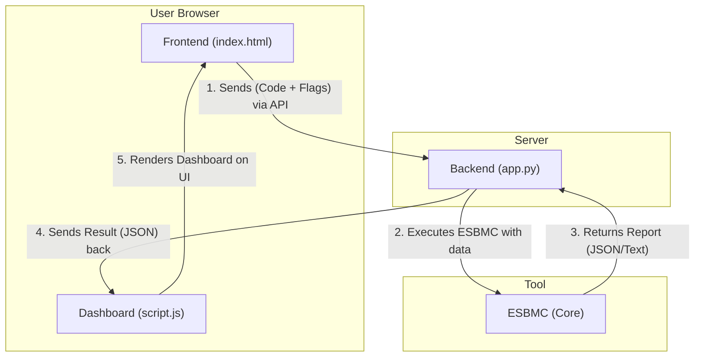
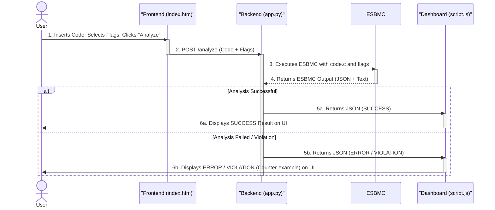

# ESBMC-Web: ESBMC Code Analyzer

ESBMC-Web is a web-based graphical user interface (GUI) for the ESBMC verifier. It allows users to write, upload, and analyze C, C++, or Python code directly in the web browser. The tool provides a user-friendly way to select various ESBMC analysis flags and parameters. Results are presented in two formats:
- **Raw Text Output**: The complete, unfiltered console log from the ESBMC tool.
- **Dashboard View**: A rich, interactive dashboard that visualizes violations, counterexamples, and execution traces, making it easier to debug failed verifications.

## Features:

- **In-Browser Code Editor**: A full-featured editor (powered by CodeMirror) with syntax highlighting for C, C++, and Python.
- **File Support**: Upload the main code file and add multiple dependency files (e.g., .h, .c, .cpp, .py) for C/C++ and Python projects.
- **Comprehensive Flag Selection**: A user-friendly interface to select dozens of ESBMC flags and parameters, including:
  - **Standard Checks**: memory-leak-check, overflow-check, data-races-check, etc.
  - **Analysis Algorithms**: incremental-bmc, k-induction, falsification, termination.
  - **Property Checking**: Granular control to disable assertions, bounds checks, pointer checks, and more.
  - **Parameters**: Set unwind, timeout, function, and context-bound.
  - **SMT Solvers**: Easily switch between Boolector (default), Z3, CVC5, Bitwuzla, and others.
  - **Dual Result View**: Toggle between the raw text log and the interactive dashboard.
  - **Interactive Dashboard**: When a violation is found, the dashboard clearly displays:
    - A clear "VERIFICATION FAILED" status.
    - Summary cards for total steps and violations.
    - A detailed table of all violations (file, function, line, and message).
    - The Counterexample (initial variable values) that triggered the failure.
    - The complete Execution Trace leading to the violation.
    - The Analyzed Source Code with the specific lines causing violations highlighted in red.


## Architecture (Simplified)

The project is divided into two parts:

- **/backend**: A Flask (Python) server that receives the code and executes ESBMC.
- **/frontend**: A static HTML/JS page that serves as the user interface.

## Architecture (Data Flow)

The diagram below illustrates the order of interactions:


```mermaid
graph TD;
    subgraph "User Browser"
        A["Frontend (index.html)"]
        D["Dashboard (script.js)"]
    end

    subgraph "Server"
        B["Backend (app.py)"]
    end

    subgraph "Tool"
         C["ESBMC (Core)"]
    end
    
    A -- "1. Sends (Code + Flags) via API" --> B;
    B -- "2. Executes ESBMC with data" --> C;
    C -- "3. Returns Report (JSON/Text)" --> B;
    B -- "4. Sends Result (JSON) back" --> D;
    D -- "5. Renders Dashboard on UI" --> A;

```

## Architecture (Sequence of Events)
The diagram below illustrates the order of interactions:


```mermaid
sequenceDiagram
    actor User
    participant Frontend as "Frontend (index.htm)"
    participant Backend_App as "Backend (app.py)"
    participant ESBMC as ESBMC
    participant Dashboard as "Dashboard (script.js)"

    User->>Frontend: 1. Inserts Code, Selects Flags, Clicks "Analyze"
    activate Frontend
    Frontend->>Backend_App: 2. POST /analyze (Code + Flags)
    deactivate Frontend
    activate Backend_App
    Backend_App->>ESBMC: 3. Executes ESBMC with code.c and flags
    activate ESBMC
    ESBMC-->>Backend_App: 4. Returns ESBMC Output (JSON + Text)
    deactivate ESBMC

    alt Analysis Successful
        Backend_App->>Dashboard: 5a. Returns JSON (SUCCESS)
        activate Dashboard
        Dashboard->>User: 6a. Displays SUCCESS Result on UI
        deactivate Dashboard
    else Analysis Failed / Violation
        Backend_App->>Dashboard: 5b. Returns JSON (ERROR / VIOLATION)
        activate Dashboard
        Dashboard->>User: 6b. Displays ERROR / VIOLATION (Counter-example) on UI
        deactivate Dashboard
    end
    deactivate Backend_App
```

## Setup and Installation

We offer two ways to run ESBMC-Web, depending on your needs:

**Option 1: Quick Start for Windows/WSL Users (Recommended)**
If you just want to use the tool without dealing with terminals or manual configurations, use our automated package.

**Requirement:** You must have WSL (Ubuntu 24.04) installed and enabled on your Windows machine.

Go to the Releases tab of this repository.

Download the .zip file of the latest release and extract it to any folder on your computer.

Double-click the 1-INSTALAR_ESBMC.bat file (First time only). It will automatically download the latest official ESBMC binary directly from GitHub and set up the Linux environment.

**Option 2: Manual Installation (For Developers / Linux / macOS)**
If you want to modify the code or are running the project natively on Linux/macOS, follow these steps:

**Prerequisites:**

Python 3.x

The ESBMC binary must be installed and available in your system's PATH.

**Clone the repository:**

```bash
git clone [https://github.com/esbmc/esbmc-web.git](https://github.com/esbmc/esbmc-web.git)
cd esbmc-web
```

***Create and activate a virtual environment:***

```bash
python3 -m venv venv
source venv/bin/activate  # Linux/macOS
# or
.\venv\Scripts\activate   # Windows

```

**Install the Python dependencies:**

```bash
cd backend
pip install -r requirements.txt
```


## Usage
**If you used Option 1 (Windows/WSL):**

Simply double-click the 2-INICIAR_WEB.bat file whenever you want to use the tool. 
It will start the server in the background, check for required dependencies automatically, and instantly open the ESBMC-Web page in your default Windows browser.

**If you used Option 2 (Manual):**

Start the backend server:
Make sure your venv is activated and run:


python3 backend/app.py
The server will start on http://127.0.0.1:5000.

Open the frontend:
Open the frontend/index.html file directly in your web browser.


## Usage

