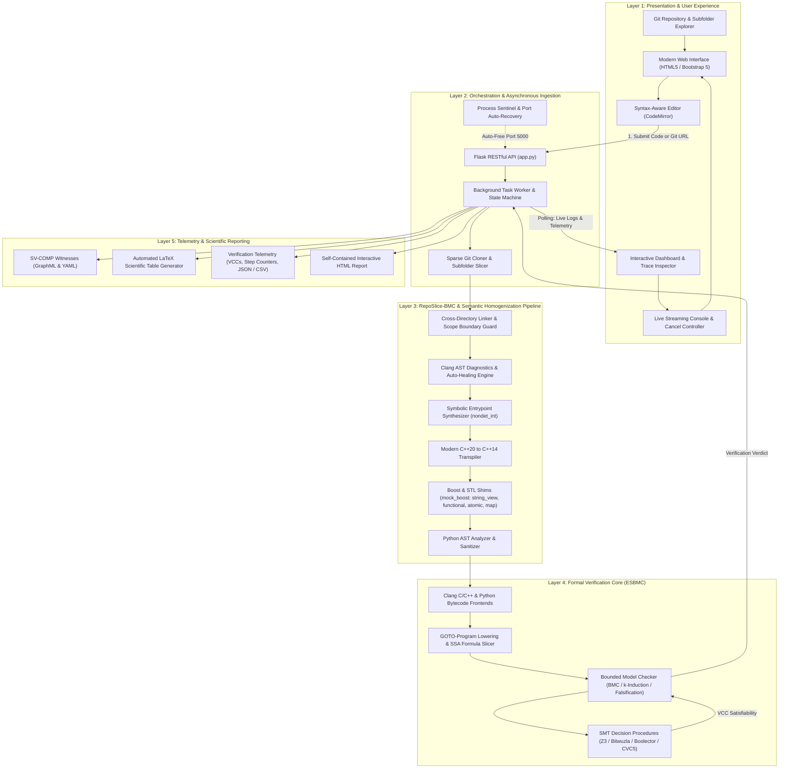
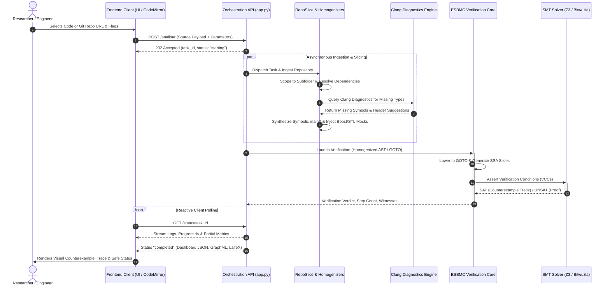

# ESBMC-Web: Advanced Formal Verification Platform & Code Analyzer

**ESBMC-Web** is an extensible, enterprise-grade web graphical interface (GUI) and verification workbench for **ESBMC (Efficient SMT-Based Bounded Model Checker)**. 

It empowers researchers, software engineers, and students to formally verify C, C++, and Python software directly in the web browser — supporting single files, multi-file projects, and **remote Git repositories with subfolder isolation and automatic semantic dependency resolution**.

---

## Key Features

### 1. In-Browser Editor & Multi-Language Support
- **Full-featured Editor**: CodeMirror editor with syntax highlighting for C, C++, and Python.
- **Multi-File & Dependency Management**: Upload main files alongside local dependencies (`.h`, `.hpp`, `.c`, `.cpp`, `.py`).

### 2. Remote Git Repository Analysis & Subfolder Isolation
- **Direct Git Ingestion**: Analyze public Git repositories via URL (`https://github.com/esbmc/esbmc` or `https://github.com/lucasccordeiro/vllm`).
- **Targeted Subfolder Scoping**: Paste links to specific subfolders (e.g., `https://github.com/esbmc/esbmc/tree/master/src/util`) or supply a folder filter to isolate and inspect only relevant files without repository clutter.
- **Single-File Isolated Verification**: Select any individual component within a complex repository and verify it with automated local dependency resolution.

### 3. RepoSlice-BMC & Intelligent Code Homogenizers (`backend/sanitizers/`)
- **C/C++ Homogenizer**:
  - Automatically heals Clang compiler diagnostics and missing type definitions.
  - Generates symbolic `int main()` harnesses with non-deterministic inputs (`nondet_int()`, symbolic buffers) for modular libraries that lack entry points.
  - Down-transpiles modern C++20 constructs (`requires`, `consteval`, `[[nodiscard]]`, standard traits) to C++14 compatibility.
- **Boost & STL Compatibility Mock Layer (`mock_boost`)**:
  - Provides lightweight stubs for missing or incomplete `esbmclibc` standard headers: `<string_view>`, `<functional>`, `<atomic>`, `<mutex>`, `<shared_mutex>`, `<condition_variable>`, `<thread>`, `<system_error>`, and recursive pointer-based `<map>` / `<unordered_map>`.
- **Cross-Directory Dependency Linker**:
  - Recursively discovers headers across the cloned tree and safely links required implementation files (`.cpp`/`.c`) while strictly respecting subsystem boundaries.
- **Python AST Sanitizer**:
  - Validates and prepares Python code for ESBMC's native Python frontend (`--python python3`).

### 4. Interactive Dashboard & Verification Reports
- **Dual View**: Seamlessly switch between the raw ESBMC terminal output and the rich visual dashboard.
- **Visual Counterexamples**:
  - Pinpoints violation locations directly on the source code.
  - Step-by-step execution traces and initial variable counterexample assignments.
- **Comprehensive Scientific Reporting**:
  - **SV-COMP Witness Export**: Download verification witnesses in **GraphML** and **YAML** formats.
  - **Academic Formats**: Automatic generation of **LaTeX tables** (ready for papers and dissertations), **CSV summary**, **interactive HTML report**, and structured **JSON**.

### 5. Asynchronous Task Architecture
- Non-blocking background verification queue with live log streaming and progress tracking.
- Interactive **Cancel Verification** control to safely terminate long-running solver tasks.
- Automatic port freeing on startup to avoid port 5000 conflicts.

---

## System Architecture

The architecture of **ESBMC-Web** is structured into five cohesive, decoupled layers designed for modularity, safety, and high-performance formal verification:


```mermaid
flowchart TD
    subgraph Layer1 ["Layer 1: Presentation & User Experience"]
        UI["Modern Web Interface (HTML5 / Bootstrap 5)"]
        Editor["Syntax-Aware Editor (CodeMirror)"]
        Tree["Git Repository & Subfolder Explorer"]
        Dash["Interactive Dashboard & Trace Inspector"]
        LogTerm["Live Streaming Console & Cancel Controller"]
    end

    subgraph Layer2 ["Layer 2: Orchestration & Asynchronous Ingestion"]
        API["Flask RESTful API (app.py)"]
        TaskQueue["Background Task Worker & State Machine"]
        PortSentinel["Process Sentinel & Port Auto-Recovery"]
        GitEngine["Sparse Git Cloner & Subfolder Slicer"]
    end

    subgraph Layer3 ["Layer 3: RepoSlice-BMC & Semantic Homogenization Pipeline"]
        SubsystemLinker["Cross-Directory Linker & Scope Boundary Guard"]
        ClangHealer["Clang AST Diagnostics & Auto-Healing Engine"]
        HarnessGen["Symbolic Entrypoint Synthesizer (nondet_int)"]
        Cpp20Lowering["Modern C++20 to C++14 Transpiler"]
        MocksBoost["Boost & STL Shims (mock_boost: string_view, functional, atomic, map)"]
        PySanitizer["Python AST Analyzer & Sanitizer"]
    end

    subgraph Layer4 ["Layer 4: Formal Verification Core (ESBMC)"]
        FrontendAST["Clang C/C++ & Python Bytecode Frontends"]
        GOTO["GOTO-Program Lowering & SSA Formula Slicer"]
        BMC["Bounded Model Checker (BMC / k-Induction / Falsification)"]
        Solvers["SMT Decision Procedures (Z3 / Bitwuzla / Boolector / CVC5)"]
    end

    subgraph Layer5 ["Layer 5: Telemetry & Scientific Reporting"]
        Witnesses["SV-COMP Witnesses (GraphML & YAML)"]
        LaTeX["Automated LaTeX Scientific Table Generator"]
        Telemetry["Verification Telemetry (VCCs, Step Counters, JSON / CSV)"]
        HTMLRep["Self-Contained Interactive HTML Report"]
    end

    UI --> Editor
    Tree --> UI
    Editor -->|1. Submit Code or Git URL| API
    API --> TaskQueue
    PortSentinel -.->|Auto-Free Port 5000| API
    TaskQueue --> GitEngine
    GitEngine --> SubsystemLinker
    SubsystemLinker --> ClangHealer
    ClangHealer --> HarnessGen
    HarnessGen --> Cpp20Lowering
    Cpp20Lowering --> MocksBoost
    MocksBoost --> PySanitizer
    PySanitizer --> FrontendAST
    FrontendAST --> GOTO
    GOTO --> BMC
    BMC --> Solvers
    Solvers -->|VCC Satisfiability| BMC
    BMC -->|Verification Verdict| TaskQueue
    TaskQueue --> Witnesses
    TaskQueue --> LaTeX
    TaskQueue --> Telemetry
    TaskQueue --> HTMLRep
    TaskQueue -->|Polling: Live Logs & Telemetry| Dash
    Dash --> LogTerm
    LogTerm --> UI
```

---

### Architectural Layers Breakdown

1. **Presentation & User Experience Layer**:
   - Built on a lightweight, reactive HTML5/Bootstrap 5 frontend.
   - Embeds CodeMirror with dynamic syntax detection and an expandable Git repository tree view.
   - Provides live polling for asynchronous tasks, real-time log streaming, and visual highlighting of source lines where counterexamples occur.

2. **Orchestration & Asynchronous Ingestion Layer**:
   - Managed by Flask (`backend/app.py`) running within WSL/Linux.
   - Implements a non-blocking task queue (`TAREFAS_ATIVAS` and `CLONE_TASKS`) with UUID-based tracking.
   - Uses `blob:none` sparse Git cloning to minimize network overhead and applies path prefixes to strictly isolate requested subfolders.
   - Incorporates a Process Sentinel that automatically cleans up zombie sockets on port 5000 prior to initialization.

3. **RepoSlice-BMC & Semantic Homogenization Pipeline (`backend/sanitizers/`)**:
   - **Cross-Directory Dependency Linker**: Resolves local header hierarchies and locates required implementation files (`.cpp`/`.c`) while strictly confining the search space to the target subsystem.
   - **Clang Auto-Healer**: Executes `clang -fsyntax-only` diagnostic sweeps to identify undefined types, missing functions, and uninstantiated constants, automatically generating corresponding fallback stubs.
   - **Symbolic Entrypoint Synthesizer**: Detects libraries without an explicit `main()` and synthesizes an entry point populated with nondeterministic variables (`nondet_int()`, symbolic arrays).
   - **ABI Compatibility Mocking**: Injects standard STL and Boost shims into `mock_boost/` (`string_view`, `functional`, `atomic`, `mutex`, pointer-based `map`) to bridge gaps in the default `esbmclibc`.

4. **Formal Verification Core (ESBMC Engine)**:
   - Translates sanitized ASTs into GOTO intermediate representations.
   - Generates Static Single Assignment (SSA) verification conditions (VCCs).
   - Encodes formulas into bit-vector and floating-point arithmetic theories and solves them using state-of-the-art SMT solvers (Z3, Bitwuzla, Boolector, CVC5).

5. **Telemetry & Scientific Reporting Layer**:
   - Aggregates solver execution metrics (CPU time, VCC generation count, solver decision procedure time).
   - Produces formal correctness witnesses conforming to the SV-COMP specification in GraphML and YAML.
   - Generates publication-ready LaTeX tables for research papers and dissertations.

---

## Verification Pipeline & Reactive Execution Flow

The sequence diagram below details the reactive, asynchronous life-cycle of a verification request from submission to report generation:


```mermaid
sequenceDiagram
    autonumber
    actor Researcher as Researcher / Engineer
    participant UI as Frontend Client (UI / CodeMirror)
    participant Flask as Orchestration API (app.py)
    participant Slicer as RepoSlice & Homogenizers
    participant Clang as Clang Diagnostics Engine
    participant ESBMC as ESBMC Verification Core
    participant SMT as SMT Solver (Z3 / Bitwuzla)

    Researcher->>UI: Selects Code or Git Repo URL & Flags
    UI->>Flask: POST /analisar (Source Payload + Parameters)
    Flask-->>UI: 202 Accepted (task_id, status: "starting")

    par Asynchronous Ingestion & Slicing
        Flask->>Slicer: Dispatch Task & Ingest Repository
        Slicer->>Slicer: Scope to Subfolder & Resolve Dependencies
        Slicer->>Clang: Query Clang Diagnostics for Missing Types
        Clang-->>Slicer: Return Missing Symbols & Header Suggestions
        Slicer->>Slicer: Synthesize Symbolic main() & Inject Boost/STL Mocks
    end

    Flask->>ESBMC: Launch Verification (Homogenized AST / GOTO)
    activate ESBMC
    ESBMC->>ESBMC: Lower to GOTO & Generate SSA Slices
    ESBMC->>SMT: Assert Verification Conditions (VCCs)
    activate SMT
    SMT-->>ESBMC: SAT (Counterexample Trace) / UNSAT (Proof)
    deactivate SMT
    ESBMC-->>Flask: Verification Verdict, Step Count, Witnesses
    deactivate ESBMC

    loop Reactive Client Polling
        UI->>Flask: GET /status/task_id
        Flask-->>UI: Stream Logs, Progress % & Partial Metrics
    end

    Flask-->>UI: Status "completed" (Dashboard JSON, GraphML, LaTeX)
    UI->>Researcher: Renders Visual Counterexample, Trace & Safe Status
```

---

## Setup and Installation

### Option 1: Quick Start for Windows / WSL Users (Recommended)

1. **Requirement**: Make sure WSL (Windows Subsystem for Linux, Ubuntu) is installed.
2. Clone or download this repository:
   ```bash
   git clone https://github.com/esbmc/esbmc-web.git
   cd esbmc-web
   ```
3. **First-time Setup**: Double-click `Install ESBMC WSL.bat` to automatically install the latest ESBMC binary and set up the Linux environment inside WSL.
4. **Launch Application**: Double-click `ESBMC-WEB.bat`.
   - The script automatically frees port 5000, checks dependencies from `requirements.txt`, launches the Flask backend daemon in the background, and opens `frontend/index.html` in your default browser.

---

### Option 2: Manual Installation (Linux / macOS / Developers)

1. **Prerequisites**:
   - Python 3.10+
   - Clang (optional, used by the C++ Auto-Healer)
   - ESBMC binary installed and available in your system's `PATH`.

2. **Clone the repository**:
   ```bash
   git clone https://github.com/esbmc/esbmc-web.git
   cd esbmc-web
   ```

3. **Set up Python Virtual Environment**:
   ```bash
   python3 -m venv venv
   source venv/bin/activate
   pip install --upgrade pip
   pip install -r backend/requirements.txt
   ```

4. **Run the Backend Server**:
   ```bash
   cd backend
   python3 app.py
   ```
   The backend starts at `http://127.0.0.1:5000`.

5. **Open the Frontend**:
   Open `frontend/index.html` directly in any modern browser.

---

## Research & Academic Attribution

If you use **ESBMC-Web** or its **RepoSlice-BMC / Homogenizer** pipeline in academic research, please cite:

- **ESBMC**: *Galdino et al., "ESBMC 7.0: Software Verification for C, C++, and Python", Formal Methods in System Design.*
- **ESBMC-Web**: Federal University of Amazonas (UFAM) / Electronic and Information Research Group.
