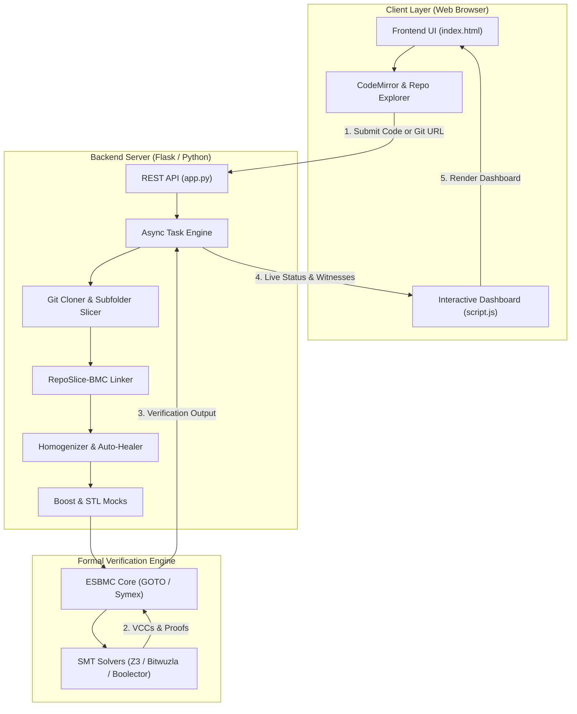
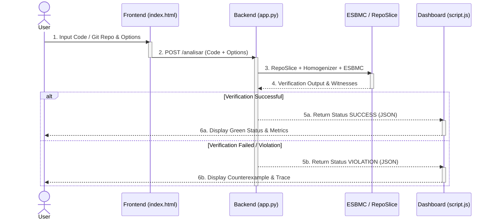

# ESBMC-Web: Advanced Formal Verification Platform & Code Analyzer
**ESBMC-Web** is a modern, extensible web-based graphical user interface (GUI) and formal verification workbench for the **ESBMC (Efficient SMT-Based Bounded Model Checker)** verifier. 
It allows software engineers, students, and researchers to verify C, C++, and Python software directly in the web browser — supporting single files, multi-file projects, and **remote Git repositories with subfolder isolation and automatic dependency resolution**.
---

## Key Features
### 1. In-Browser Editor & Multi-Language Support
- **Full-featured Editor**: CodeMirror editor with syntax highlighting for C, C++, and Python.
- **Multi-File & Dependency Management**: Upload main files alongside local dependencies (`.h`, `.hpp`, `.c`, `.cpp`, `.py`).
### 2. Remote Git Repository Analysis & Subfolder Isolation
- **Direct Git Cloning**: Provide a Git repository URL (e.g., `https://github.com/esbmc/esbmc` or `https://github.com/lucasccordeiro/vllm`).
- **Targeted Subfolder Scoping**: Paste links to specific subfolders (e.g., `https://github.com/esbmc/esbmc/tree/master/src/util`) or supply a folder filter to isolate and inspect only relevant files without repository clutter.
- **Single-File Isolated Verification**: Select any individual component within a complex repository and verify it with automated local dependency resolution.
### 3. RepoSlice-BMC & Intelligent Code Homogenizers (`backend/sanitizers/`)
- **C/C++ Homogenizer**:
  - Automatically heals Clang compiler diagnostics and missing type definitions.
  - Generates symbolic `int main()` harnesses with non-deterministic inputs (`nondet_int()`, symbolic buffers) for modular libraries that lack entry points.
  - Down-transpiles modern C++20 constructs (`requires`, `consteval`, `[[nodiscard]]`, standard traits) to C++14 compatibility.
- **Boost & STL Compatibility Mock Layer (`mock_boost`)**:
  - Provides lightweight stubs for missing or incomplete `esbmclibc` standard headers: `<string_view>`, `<functional>`, `<atomic>`, `<mutex>`, `<shared_mutex>`, `<condition_variable>`, `<thread>`, `<system_error>`, and recursive pointer-based `<map>` / `<unordered_map>`.
- **Cross-Directory Dependency Linker**:
  - Recursively discovers headers across the cloned tree and safely links required implementation files (`.cpp`/`.c`) while strictly respecting subsystem boundaries.
- **Python AST Sanitizer**:
  - Validates and prepares Python code for ESBMC's native Python frontend (`--python python3`).
### 4. Interactive Dashboard & Verification Reports
- **Dual View**: Seamlessly switch between the raw ESBMC terminal output and the rich visual dashboard.
- **Visual Counterexamples**:
  - Pinpoints violation locations directly on the source code.
  - Step-by-step execution traces and initial variable counterexample assignments.
- **Comprehensive Scientific Reporting**:
  - **SV-COMP Witness Export**: Download verification witnesses in **GraphML** and **YAML** formats.
  - **Academic Formats**: Automatic generation of **LaTeX tables** (ready for papers and dissertations), **CSV summary**, **interactive HTML report**, and structured **JSON**.
### 5. Asynchronous Task Architecture
- Non-blocking background verification queue with live log streaming and progress tracking.
- Interactive **Cancel Verification** control to safely terminate long-running solver tasks.
- Automatic port freeing on startup to avoid port 5000 conflicts.
---

## Architecture (Data Flow)


```mermaid
flowchart TD
    subgraph Client ["Client Layer (Web Browser)"]
        UI["Frontend UI (index.html)"]
        Editor["CodeMirror & Repo Explorer"]
        Dash["Interactive Dashboard (script.js)"]
    end

    subgraph Server ["Backend Server (Flask / Python)"]
        API["REST API (app.py)"]
        TaskManager["Async Task Engine"]
        GitWorker["Git Cloner & Subfolder Slicer"]
        RepoSlice["RepoSlice-BMC Linker"]
        Homogenizer["Homogenizer & Auto-Healer"]
        Mocks["Boost & STL Mocks"]
    end

    subgraph Engine ["Formal Verification Engine"]
        ESBMC["ESBMC Core (GOTO / Symex)"]
        Solvers["SMT Solvers (Z3 / Bitwuzla / Boolector)"]
    end

    UI --> Editor
    Editor -->|1. Submit Code or Git URL| API
    API --> TaskManager
    TaskManager --> GitWorker
    GitWorker --> RepoSlice
    RepoSlice --> Homogenizer
    Homogenizer --> Mocks
    Mocks --> ESBMC
    ESBMC --> Solvers
    Solvers -->|2. VCCs & Proofs| ESBMC
    ESBMC -->|3. Verification Output| TaskManager
    TaskManager -->|4. Live Status & Witnesses| Dash
    Dash -->|5. Render Dashboard| UI
```

---

## Architecture (Sequence of Events)


```mermaid
sequenceDiagram
    actor User as User
    participant Frontend as Frontend (index.html)
    participant Backend as Backend (app.py)
    participant Engine as ESBMC / RepoSlice
    participant Dashboard as Dashboard (script.js)

    User->>Frontend: 1. Input Code / Git Repo & Options
    activate Frontend
    Frontend->>Backend: 2. POST /analisar (Code + Options)
    deactivate Frontend
    activate Backend
    Backend->>Engine: 3. RepoSlice + Homogenizer + ESBMC
    activate Engine
    Engine-->>Backend: 4. Verification Output & Witnesses
    deactivate Engine

    alt Verification Successful
        Backend-->>Dashboard: 5a. Return Status SUCCESS (JSON)
        activate Dashboard
        Dashboard-->>User: 6a. Display Green Status & Metrics
        deactivate Dashboard
    else Verification Failed / Violation
        Backend-->>Dashboard: 5b. Return Status VIOLATION (JSON)
        activate Dashboard
        Dashboard-->>User: 6b. Display Counterexample & Trace
        deactivate Dashboard
    end
    deactivate Backend
```


## Setup and Installation

We offer two ways to run ESBMC-Web, depending on your needs:

**Option 1: Quick Start for Windows/WSL Users (Recommended)**
If you just want to use the tool without dealing with terminals or manual configurations, use our automated package.

**Requirement:** You must have WSL (Ubuntu 24.04) installed and enabled on your Windows machine.

Go to the Releases tab of this repository.

Download the .zip file of the latest release and extract it to any folder on your computer.

Double-click the 1-INSTALAR_ESBMC.bat file (First time only). It will automatically download the latest official ESBMC binary directly from GitHub and set up the Linux environment.

**Option 2: Manual Installation (For Developers / Linux / macOS)**
If you want to modify the code or are running the project natively on Linux/macOS, follow these steps:

**Prerequisites:**

Python 3.x

The ESBMC binary must be installed and available in your system's PATH.

**Clone the repository:**

```bash
git clone [https://github.com/esbmc/esbmc-web.git](https://github.com/esbmc/esbmc-web.git)
cd esbmc-web
```

***Create and activate a virtual environment:***

```bash
python3 -m venv venv
source venv/bin/activate  # Linux/macOS
# or
.\venv\Scripts\activate   # Windows

```

**Install the Python dependencies:**

```bash
cd backend
pip install -r requirements.txt
```


## Usage
**If you used Option 1 (Windows/WSL):**

Simply double-click the 2-INICIAR_WEB.bat file whenever you want to use the tool. 
It will start the server in the background, check for required dependencies automatically, and instantly open the ESBMC-Web page in your default Windows browser.

**If you used Option 2 (Manual):**

Start the backend server:
Make sure your venv is activated and run:


python3 backend/app.py
The server will start on http://127.0.0.1:5000.

Open the frontend:
Open the frontend/index.html file directly in your web browser.
